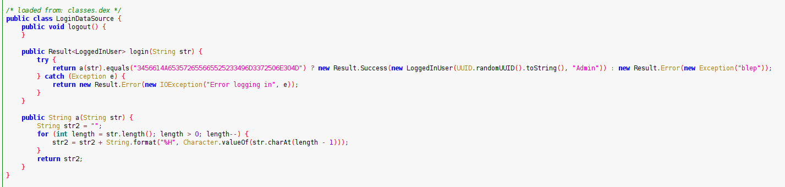
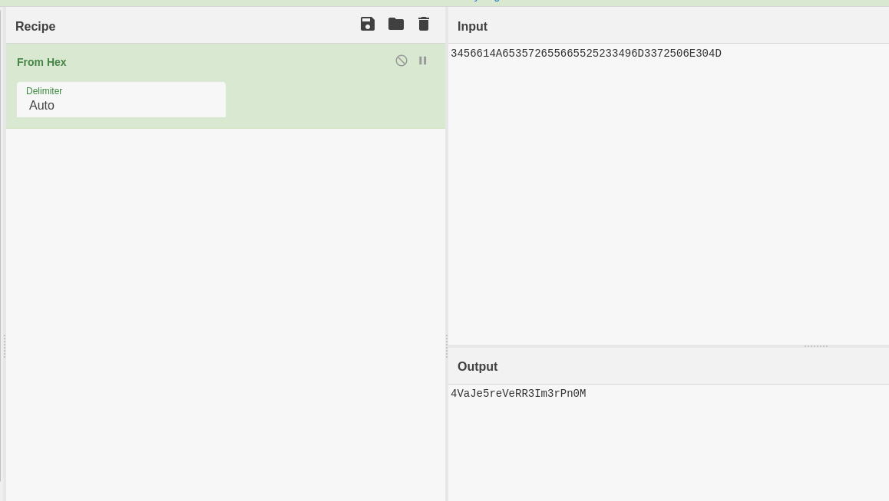

# AdminPanel (Android)

---

So, we have a .apk, lets decompile it ! I used [jadx]([https://github.com/skylot/jadx](https://github.com/skylot/jadx)).

After browsing the code, I found this code : 

We clearly see what is going on here, our password is encoded in the `a()` function :

- Every char is passed through the %H formater, which return the hex value of a char.
- The string is encoded in the reverse order

After that, the encoded string is compared to `3456614A653572655665525233496D3372506E304D`.

## Obtaining the flag

So we have an encoded string, let’s decode it ! We can dedcode it on [Cyberchef]([https://gchq.github.io/CyberChef](https://gchq.github.io/CyberChef)) like this : 

We got : `4VaJe5reVeRR3Im3rPn0M`, which reversed is : `M0nPr3mI3RReVer5eJaV4`

And we have the flag : `MCTF{M0nPr3mI3RReVer5eJaV4}`

## Conclusion

It was a cool little android reverse challenge, surpised that he wasn’t flagged that much.