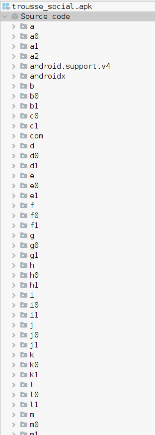
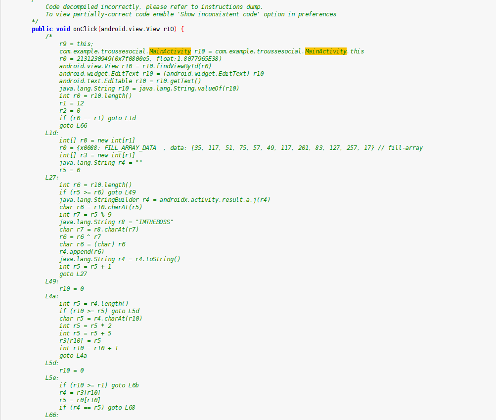
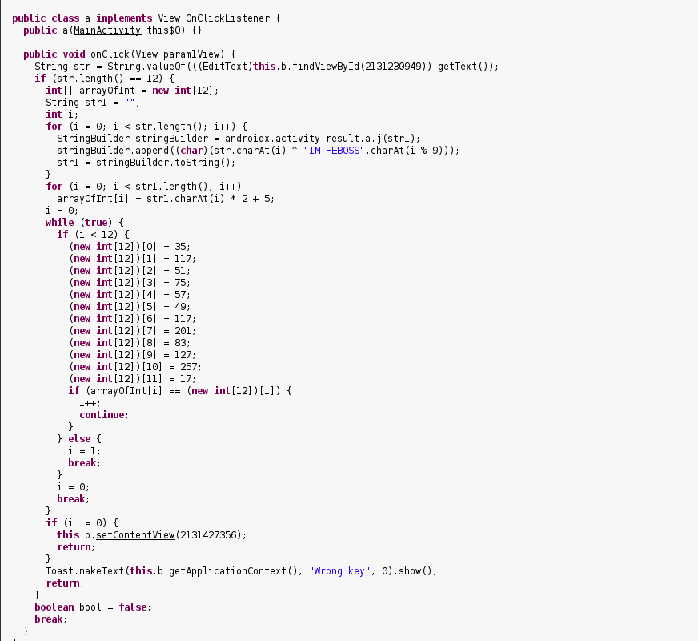
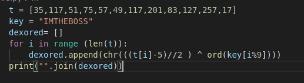

# Trousse social (Android)

---

The second (and the last) android challenge ! 

Same start that the other one, we open the .apk in `jadx`.



WOW ! That’s a lot of directories ! When can see the `com` folder, in it we can found the MainActivity of the application, but the code hasn’t decompiled very well, as you can see :



Let’s get back in the context → It’s 4am, I’m tired, i don’t want to reverse this. So i tried to get a `.jar` from the `.apk` .

## Getting a .jar

I used `dex2jar` : like this

```bash
$ sh dex2jar-2.0/d2j-dex2jar.sh trousse_social.apk
```

I opened it in `jd-gui` , looked like this :



As you can see, it’s much better. Our input `str1` is xored with “IMTHEBOSS”, then each char (his charCode ) is multplied by 2 and 5 is added , finaly each char compared with an array of charCodes. 

I made a little python script to reverse this



And we got the flag : `MCTF{FuCk_Tw1tt3R}`

## Conclusion

Also a nice challenge, he gets really easier when converter to a jar and passed through jd-gui

Hope you like this little writeup !